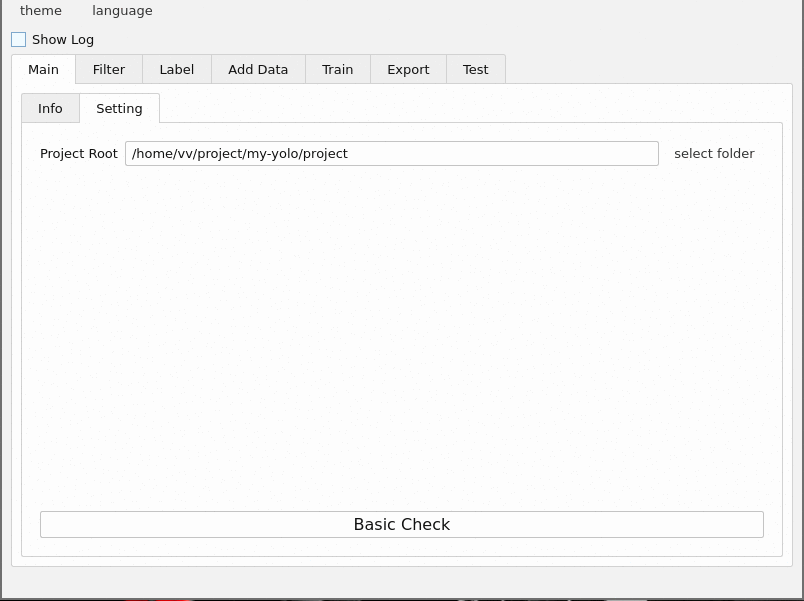

## Project Status

**Beta on Linux**



## Depend

- Python 3.12
- Qt 6
- OpenCV 4
- spdlog 1.15.0 ((already include)

## Training Process

### 1. Basic Check

1. check python(your system)
2. check folder `project`(current folder)
3. check venv and set the python mirror site to `https://mirrors.tuna.tsinghua.edu.cn/`
4. check script in folder `project/script`
5. check tools(current means `LabelImg`)
6. check yolov5

### 2. Filter

Using the SSIM algorithm to remove similar images, there are **still problems at this stage**

### 3. Label

call `LabelImg`

### 4. Add Data

### 5. Train

call yolov5 `train.py`

### 6. Export

call yolov5 `export.py`

### 7. Test

call yolov5 `detect.py`

or

use OpenCV to test onnx(**there may be problems**)

## File Struct

```bash
.
├── CMakeLists.txt
├── project
│   ├── script
│   ├── tools
│   ├── train
│   ├── venv
│   └── yolov5-master
├── README.md
├── myYolo_qt
│   ├── common
│   ├── include
│   ├── main.cpp
│   ├── mainwindow.cpp
│   ├── mainwindow.h
│   ├── mainwindow.ui
│   ├── myYolo.qrc
│   ├── res
│   ├── util
│   ├── WidgetAddData
│   ├── WidgetExport
│   ├── WidgetFilter
│   ├── WidgetLabel
│   ├── WidgetLog
│   ├── WidgetMain
│   ├── WidgetTest
│   └── WidgetTrain
├── train.drawio
└── vendor
    └── spdlog-1.15.0
```
- CMakeLists.txt: cmake file
- project: default project folder
  - script: script folder
  - tools: tools folder(LablImg)
  - train: training related file
  - venv: python venv folder
  - yolov5-master: yolov5 folder, some custom modifications have been made
- README.md
- `myYolo_qt`: source code of myYolo in Qt
  - common
  - include
  - main.cpp
  - mainwindow.cpp
  - mainwindow.h
  - mainwindow.ui
  - myYolo.qrc
  - res
  - util
  - WidgetAddData: widget of add data
  - WidgetExport: widget of export model
  - WidgetFilter: widget of filter data
  - WidgetLabel: widget of label
  - WidgetLog: widget of log message
  - WidgetMain: widget of main
  - WidgetTest: widget of test
  - WidgetTrain: widget of train
- myYolo.drawio: design
- vendor: third source lib
  - spdlog-15.0: log lib

## Necessary operate

### `myYolo_qt`

```bash
mkdir build
cd build
cmake ..
make -j$(nproc)
./myYolo
```
### `myYolo_web`

```bash
npm install
npm build
```

### requirements

use venv(myYolo will create)

```bash
cd project
# Windows cmd
./venv/scripts/activate
# Linux cmd
souce venv/bin/activate
```

install

```bash
pip install -r project/yolov5-master/requirements.txt
```

## Code Format

use `clang-format` to format code

### Linux usage:

```bash
find src -name "*.cpp" -o -name "*.h" | xargs clang-format -i
```

## Windows

### LabelImg

```bash
./project/tools/windows/labelImg
├── data
│   └── predefined_classes.txt
└── labelImg.exe
```

## Linux

### LabelImg

1. Create venv dir

```bash
python -m venv venv
source ./venv/bin/active
```

2. install lib

```bash
pip install pyqt5
pip install lxml
```

3. build

```bash
make qt5py3
```

4. run

```bash
python labelImg.py
```


### Problem

1. 

```bash
Traceback (most recent call last):
  File "/home/vv/project/my-yolo/project/tools/linux/labelImg-1.8.1/libs/canvas.py", line 458, in paintEvent
    p.drawLine(self.prevPoint.x(), 0, self.prevPoint.x(), self.pixmap.height())
TypeError: arguments did not match any overloaded call:
  drawLine(self, l: QLineF): argument 1 has unexpected type 'float'
  drawLine(self, line: QLine): argument 1 has unexpected type 'float'
  drawLine(self, x1: int, y1: int, x2: int, y2: int): argument 1 has unexpected type 'float'
  drawLine(self, p1: QPoint, p2: QPoint): argument 1 has unexpected type 'float'
  drawLine(self, p1: Union[QPointF, QPoint], p2: Union[QPointF, QPoint]): argument 1 has unexpected type 'float'
Aborted
```

2. 

```bash
Cancel creation.
Image:/home/vv/tmp/my_adventure/1.jpg -> Annotation:/home/vv/tmp/my_adventure/1.xml
Traceback (most recent call last):
  File "/home/vv/project/my-yolo/project/tools/linux/labelImg-1.8.1/libs/canvas.py", line 438, in paintEvent
    shape.paint(p)
  File "/home/vv/project/my-yolo/project/tools/linux/labelImg-1.8.1/libs/shape.py", line 130, in paint
    painter.drawText(min_x, min_y, self.label)
TypeError: arguments did not match any overloaded call:
  drawText(self, p: Union[QPointF, QPoint], s: Optional[str]): argument 1 has unexpected type 'float'
  drawText(self, rectangle: QRectF, flags: int, text: Optional[str]): argument 1 has unexpected type 'float'
  drawText(self, rectangle: QRect, flags: int, text: Optional[str]): argument 1 has unexpected type 'float'
  drawText(self, rectangle: QRectF, text: Optional[str], option: QTextOption = QTextOption()): argument 1 has unexpected type 'float'
  drawText(self, p: QPoint, s: Optional[str]): argument 1 has unexpected type 'float'
  drawText(self, x: int, y: int, width: int, height: int, flags: int, text: Optional[str]): argument 1 has unexpected type 'float'
  drawText(self, x: int, y: int, s: Optional[str]): argument 1 has unexpected type 'float'
Aborted
```

3.

```bash
Cancel creation.
Image:/home/vv/tmp/my_adventure/1.jpg -> Annotation:/home/vv/tmp/my_adventure/1.xml
Traceback (most recent call last):
  File "/home/vv/project/my-yolo/project/tools/linux/labelImg-1.8.1/libs/canvas.py", line 438, in paintEvent
    shape.paint(p)
  File "/home/vv/project/my-yolo/project/tools/linux/labelImg-1.8.1/libs/shape.py", line 130, in paint
    painter.drawText(min_x, min_y, self.label)
TypeError: arguments did not match any overloaded call:
  drawText(self, p: Union[QPointF, QPoint], s: Optional[str]): argument 1 has unexpected type 'float'
  drawText(self, rectangle: QRectF, flags: int, text: Optional[str]): argument 1 has unexpected type 'float'
  drawText(self, rectangle: QRect, flags: int, text: Optional[str]): argument 1 has unexpected type 'float'
  drawText(self, rectangle: QRectF, text: Optional[str], option: QTextOption = QTextOption()): argument 1 has unexpected type 'float'
  drawText(self, p: QPoint, s: Optional[str]): argument 1 has unexpected type 'float'
  drawText(self, x: int, y: int, width: int, height: int, flags: int, text: Optional[str]): argument 1 has unexpected type 'float'
  drawText(self, x: int, y: int, s: Optional[str]): argument 1 has unexpected type 'float'
Aborted
```

### Deal

labelImg.py:

```python
-        bar.setValue(bar.value() + bar.singleStep() * units)
+        bar.setValue(int(bar.value() + bar.singleStep() * units))
```

canvas.py:

```python
-            p.drawRect(leftTop.x(), leftTop.y(), rectWidth, rectHeight)
+            p.drawRect(int(leftTop.x()), int(leftTop.y()), int(rectWidth), int(rectHeight))


-            p.drawLine(self.prevPoint.x(), 0, self.prevPoint.x(), self.pixmap.height())
-            p.drawLine(0, self.prevPoint.y(), self.pixmap.width(), self.prevPoint.y())
+            p.drawLine(int(self.prevPoint.x()), 0, int(self.prevPoint.x()), int(self.pixmap.height()))
+            p.drawLine(0, int(self.prevPoint.y()), int(self.pixmap.width()), int(self.prevPoint.y()))
```

shape.py:

```python
-                    painter.drawText(min_x, min_y, self.label)
+                    painter.drawText(int(min_x), int(min_y), self.label)
```

